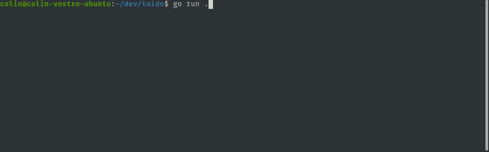

An opinionated terminal interface for efficient browsing and management of [[x]it!](https://github.com/jotaen/xit) formatted todo items. Inspired, loosely, by _Getting Things Done_ (David Allen) and informed by various entries of the self-help skills & habits genre (Charles Duhigg, James Clear, Anders Ericsson, etc).

## Features

- [x] searches the working directory recursively for [x]it! compatible items in `.xit`, `.md`, and `.txt` files
- [x] compactly displays pending todos and offers navigation between `todo` and `done`
- [x] allows for creating new items, updating existing items, and persists updates to disk
- [x] allows for filtering via `tags`
- [x] one-button (`p`) pomodoro mode for timeboxed focus on individual items; tracks overall time spend
- [x] one-button (`z`) progressive snooze parks items for 1,2,3,5,8,... days
- [x] progressive deterrence for adding new items



## Usage

From some directory containing `[x]it!` files / items, or from anywhere to recover items written in app:

```
tuido
```

### In app controls

- **?**: help
- **n**: make a new item
- slected item controls:
  - **[space]**: set status open
  - **x**, **X**: set status checked (done)
  - **s**, **~**: set status obsolete
  - **a**, **@**: set status ongoing
  - **e**: edit item text
  - **p**: enter a pomodoro session for item
  - **z**: snooze this item (set a later active date)
  - **!**/**1**: bump/decrement the `importance` modifier on this item
- **[tab]**: switch between pending and done items
- **/**: filter list by `#tags`
- **[up]**, **[down]**: navigate items
- **q**: quit

### Shorthands

`tuido` permits some shorthands for authoring items with time & date content. Shorthand timespans take the form `NT`, where `N` is some number, and `T` is one of `m`, `h`, `d`, `w`, `M`, or `y` (minute, hour, day, week, month, and year). `4d` is four days, `253h` is 253 hours, etc.

An item shorthand is one of:

- `d` (due)
- `a` (active after)
- `r` (recurs every)
- `e` (estimate)

followed by a shorthand timespan.

Examples:

- `english 1101 comparison paper d2w` will expand into `english 1101 comparison paper #due=YYYY-MM-DD`, with the date appropriately filled in for two weeks from now
- `call mom r1w` will expand into `call mom #repeat=1w`, which will reschedule itself one week into the future each time it is marked complete.
- `a1m catch up on stranger things` expands into `#active=YYYY-MM-DD catch up on stranger things`, with the date one month from now. This hides the item from view until the active date - essentially setting yourself a reminder for the future.
- `fix the sink e2h` expands into `fix the sink #estimate=2h`

### Sorting

Displayed items are sorted like this:

1. sort by how important items are (the number of leading !s). Adjust an item's importance with `!` and `1`.
2. sort by the specified due dates, if any due date is present (eg, with the #due= tag)
3. sort alphabetically

### Configuration

Tuido writes new items by default to `$HOME/.tuido/YYYY-MM-DD.xit`. To set a different write location, create file `tuido.conf` in the user config directory (`$HOME/.config` in linux, `$HOME/AppData` in windows). The write location can be a file, which will be appended to, or a directory, which whill recieve datestamped `.xit` files as in the default setting.

```
writeto=~/mysingletodolist.txt
```

```
writeto=~/todos
```

Include a `.tuido` file in individual directories to add filetypes for parsing along that subtree.

```
extensions=go,js,cpp
```

Default configuration values are:

```
writeto=~/.tuido
extensions=xit,txt,md
```

## Development

0. install go (see https://go.dev)
1. (suggested) read the in-readme tutorial for https://github.com/charmbracelet/bubbletea
2. clone repo
3. `go run .`

tuido is dogfooding. The project's `.tuido` file:

- instructs tuido to parse items in `.go` files as well as the defaults.
- instructs tuido to write new items directly to this readme

Result being that the app, running in test, contains a good running list of development todos & a convenient method to append to the roadmap.

## Licence

GPL

## Roadmap

- [ ] #feat allow for copying current item to clipboard (via `ctrl-C?`)
- [ ] #feat make new-items repsect the filetype being written to (leading comment slashes for code files, leading bullet for readme, etc)
- [@] process #dates
  - [x] from items themselves
    - [x] from #due tags
    - [ ] according to [x]it spec
  - [x] (for creation #date) from the names of an item's source file
- [@] #ui sort items by priority [x], age [ ], or due #dates [x]
- [ ] #feat #ui provide details / context (preview into source file) on current selected item, or quick open of an item's source location
- [ ] #feat allow plain-text fuzzy text search/filter of item body text (only tag names currently)
- [ ] have infrastructure for managing task-specific checklist files (beach trip) #feat #ui #maybe
- [@] #feat #maybe accept command line flags or config for other file extenstions, source directories, etc
- [ ] #feat #maybe fully respect / implement the [x]it spec
- [ ] #feat respect .gitignore configs
- [x] tag v0.0.1, produce platform builds
- [ ] add command-line flags for
  - [ ] ignoring current working dir (ie, run only in the write-to directory) `tuido --norecurse`
  - [ ] printing a list to stdout, rather than launching an app. `tuido --print`
  - [ ] viewing and setting config. `tuido --config extensions=xit,md,go,js,ts`
- [ ] #maybe allow marking items done or obsolete during a pomodoro (closes the pomo)
- [ ] #maybe mark items [ongoing] when entering a pomo
- [x] #maybe add a #spent=timespan tag which gets updated on pomo exits & by shorthand
  - [ ] #maybe generate reports on #estimate=x vs #spent=y, categorizing by tag, etc
